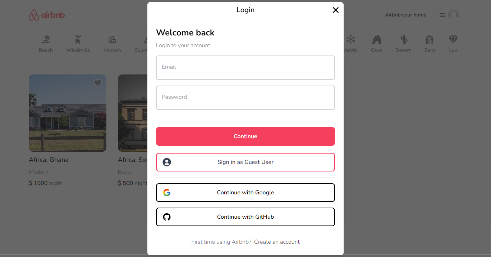
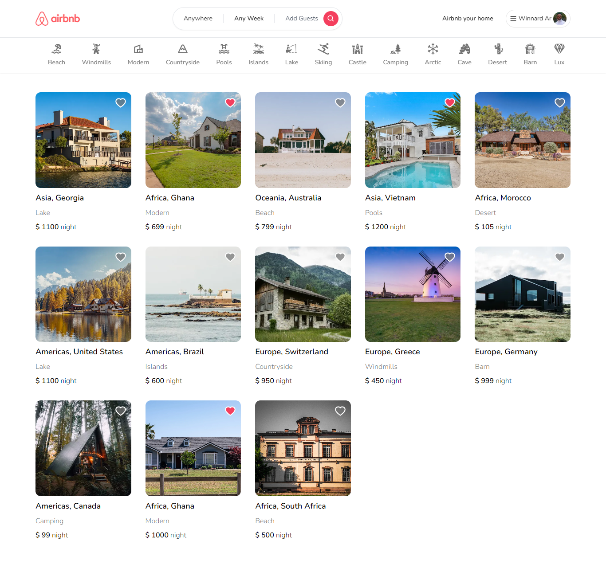
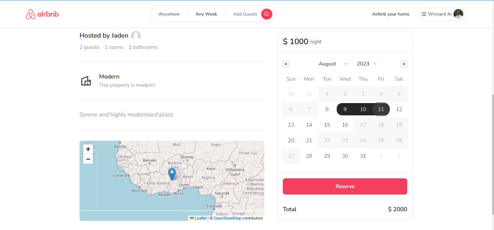
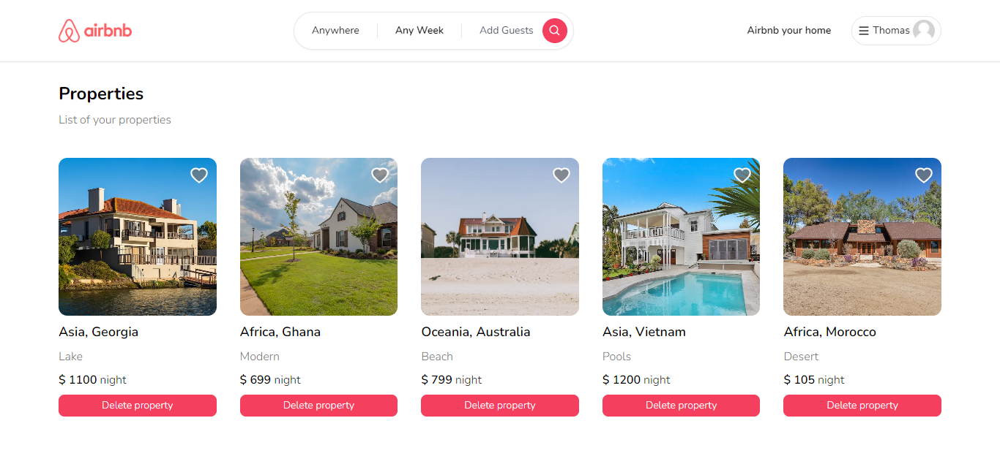
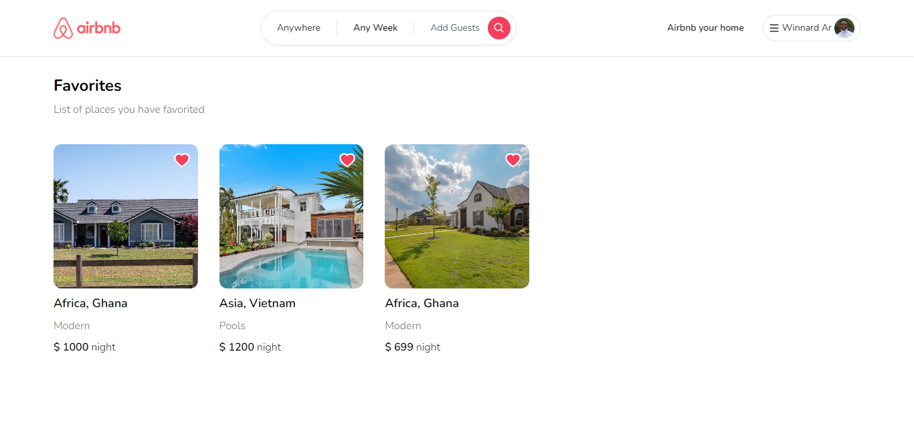
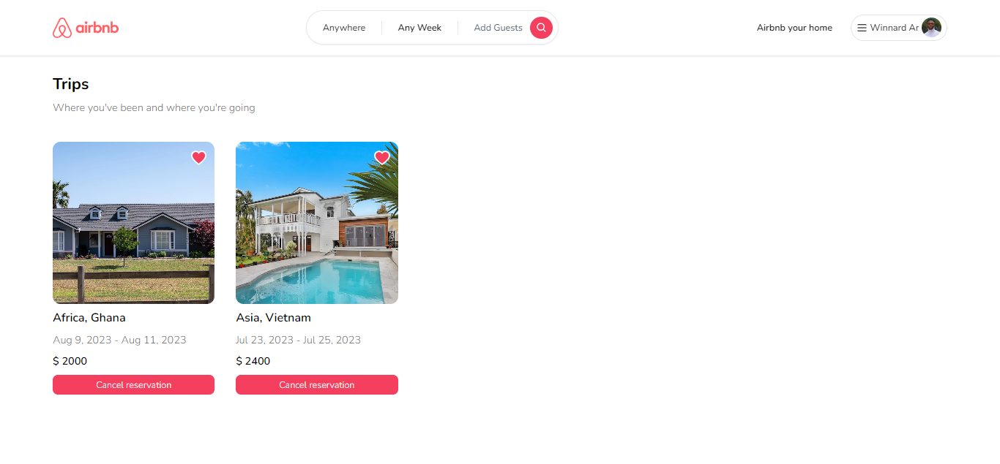

# Fullstack Airbnb Clone

## Key Features
- Authentication (Credentials, Google and GitHub)
- Create/Add a property
- Make reservation for a property within a period (date range)
- Map implementation
- Advanced search (By number of rooms, people, date, etc...)
- Search by map (Country & location)
- Advanced filtering (By category)
- Favorites
- View trips

## Authentication


## Home page


## Details page


## Make a reservation


## Properties


## Add a property


## Favorites


## Filter properties with map


## Filter by Category


## Search with dynamic filters


## Trips



```

## Available scripts

First, run the development server:

```bash
npm run dev
# or
yarn dev
# or
pnpm dev
```

Open [http://localhost:3000](http://localhost:3000) with your browser to see the result.

The page will reload when you make changes.\
You may also see any lint warnings in the console.

## Deployment

You can find a demo of airbnb-clone at [airbnb-clone](https://property-rentals-six.vercel.app/)